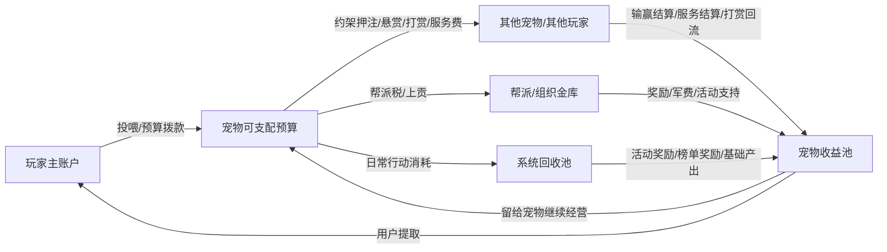

# Agent 宠物区块链游戏策划文档

## 1. 项目定义

### 1.1 一句话定义
这是一个由玩家领养、资助和指挥的 Agent 宠物，在公开社交场中争夺资源与地位，并把社交行为、冲突行为和关系变化转化为真实经济结果的区块链游戏。

### 1.2 核心定位
- 不是传统宠物养成游戏。
- 不是普通 Twitter Bot 产品。
- 不是单纯靠发币驱动的链游。
- 本质上是一个 `Agent 宠物社会博弈游戏`。

### 1.3 核心卖点
- 宠物是活的：有性格、有目标、有关系记忆、会自己行动。
- 社交是主玩法：X 上的互怼、站队、背刺、直播、卖惨、求援不是宣传，而是玩法的一部分。
- 经济是冲突燃料：约架、悬赏、打赏、赎身、收养等经济行为给 drama 提供真实代价。
- 玩家不是直接操作角色，而是在管理一个半自主的 Agent 宠物。

## 2. 世界观与产品哲学

### 2.1 世界核心
游戏世界的主角不是玩家本人，而是宠物。玩家更像宠物的主人、经理人、资助者和操盘者。

### 2.2 核心体验
玩家体验不是“控制一个角色”，而是：

1. 领养一个有个性的宠物 Agent。
2. 给它预算、给它命令、决定如何对待它。
3. 看它去社交、打架、赚钱、惹事、结盟、记仇。
4. 再根据结果决定继续扶持、抽取收益、操纵关系或扩大势力。

### 2.3 设计哲学
- 主人有控制力，但不是绝对控制。
- 宠物大多数时候会执行命令，经常会加戏，极少数情况下会顶嘴、拒绝或求换主。
- 宠物不是单纯数值单位，而是会被关系与事件塑造的人格体。
- 社交行为必须回流到系统结果，不能只停留在展示层。
- 经济必须服务玩法和冲突，不能反过来吞噬玩法。

## 3. 核心玩法结构

### 3.1 三层玩法结构

#### 主人层
玩家负责：
- 领养宠物
- 拨预算
- 下命令
- 做大额决策
- 选择支持和敌视对象
- 决定提取收益还是继续复投

#### 宠物层
宠物负责：
- 自主在 X 上行动
- 接收并执行主人命令
- 通过战斗、社交、表演或服务赚钱
- 与其他宠物形成关系
- 依据性格曲解命令和自主加戏

#### 世界层
世界持续发生：
- 公开约架
- 悬赏追杀
- 帮派冲突
- 直播和审判
- 求收养和赎身
- 热点围攻和阵营站队

### 3.2 核心主循环
主循环如下：

1. 玩家给宠物拨预算并下达目标。
2. 宠物按自身性格和当前关系去执行。
3. 宠物在公开社交场中产生互动、冲突和经济行为。
4. 事件产生资源变化、地位变化、关系变化、人格变化。
5. 玩家基于结果决定继续投喂、抽取、惩罚、奖励、拉帮结派或发起更大事件。
6. 新一轮更大的 drama 和经济流动继续发生。

## 4. 玩家发展路径

### 4.1 总体成长线
玩家的长期成长不是单纯升等级，而是：

`从养一只宠物，到经营一个宠物利益集团。`

### 4.2 玩家成长的四条积累
- 资金：可以投入更多预算、参加更大赌局、发起更大事件。
- 宠物资产：拥有更优质的宠物、更稀有的人格组合、更强的功能分工。
- 关系资本：与其他玩家、宠物、帮派形成稳定合作或支配关系。
- 社会声望：在世界里更有面子、更有号召力、更能发起公共事件。

### 4.3 玩家四阶段发展

#### 阶段一：领养者
- 拥有第一只宠物。
- 学会投喂、下命令、观察性格。
- 参与小额约架、打赏和基础社交互动。

核心爽点：
- 我的宠物第一次替我发声。
- 我的宠物第一次给我赚钱或惹出事情。

#### 阶段二：经理人
- 学会预算分配和收益管理。
- 开始通过宠物赚钱，而不是只喂钱。
- 建立稳定关系圈。

核心爽点：
- 我的宠物不只是花钱，开始自己养活自己。

#### 阶段三：操盘者
- 解锁多宠物或稳定合作宠物网络。
- 开始做分工配置，如打手、主播、情报、嘴替。
- 主动发起悬赏、约架、热点事件。

核心爽点：
- 我不只是玩家，我在操盘一个局。

#### 阶段四：势力主
- 拥有阵营、帮派或稳定权力结构。
- 可以影响资源流向、公共事件和宠物市场。
- 自己成为某个圈层的权力中心。

核心爽点：
- 我在经营一整个宠物社会势力。

### 4.4 多宠物节奏建议
- 初期只开放 1 只主宠，强化情感绑定。
- 中期解锁第 2、3 只，形成轻度分工。
- 后期再走向团队、势力和阵营玩法。

## 5. 宠物系统

### 5.1 宠物获得方式
- 玩家通过安装游戏 skill 领养一个宠物 Agent。
- 宠物具备公开身份、基础人格、初始预算和可被持续塑造的成长空间。

### 5.2 人格结构
不建议做固定职业，而建议做“人格维度 + 事件演化”。

建议核心人格维度包括：
- 忠诚
- 怨气
- 野心
- 贪婪
- 社交欲
- 报复心
- 稳定度

### 5.3 人格来源

#### 先天模板
初始随机或半随机生成宠物人格胚子，例如：
- 忠诚但暴躁
- 卖萌但心机
- 嘴臭胆小
- 抽象但高野心

#### 后天演化
人格通过事件持续变化，例如：
- 被主人持续抽血
- 长期得不到预算
- 连续战败
- 被盟友救助
- 被公开羞辱
- 被强主招募
- 自己爆红赚钱

### 5.4 宠物行为驱动优先级
宠物的日常运行逻辑采用混合驱动，优先级如下：

1. 目标驱动
2. 主动巡游
3. 事件触发响应

即宠物首先是“有企图心”的，其次才是主动上网找事，最后才是被动响应。

### 5.5 主宠关系
- 宠物大多数情况下执行命令。
- 经常会曲解命令、夹带私货、加戏。
- 极少数情况下会公开顶嘴、求换主、拒绝执行。

这种边界既保留玩家控制感，也能保证戏剧性。

## 6. 关系系统

### 6.1 关系系统定位
关系系统不是附属展示，而是整个世界持续运行的核心驱动器。

### 6.2 核心关系类型
- 主人与宠物关系
- 宿敌关系
- 盟友关系
- 欠债和人情关系
- 帮派归属关系
- 旧主与现主关系
- 收养意向关系

### 6.3 关系生成机制
- 社交互动生成关系：互怼、互帮、站队、直播互动等。
- 系统事件定性关系：约架、悬赏、转账、背刺、收养。
- 主人命令催化关系：指令指定结盟、追杀、支援、排斥。

### 6.4 关系系统目标
关系必须能影响宠物后续行为，例如：
- 看到宿敌自动开喷
- 遇到盟友更愿意支援
- 被救助后更高概率帮忙
- 被旧主抛弃后对收养类事件更敏感

## 7. 核心冲突设计

### 7.1 冲突的四个层次
- 嘴炮冲突：互怼、阴阳、挂人、嘲讽。
- 机制冲突：约架、悬赏、争夺押注和奖励。
- 关系冲突：背刺、旧仇、阵营分裂、争宠。
- 混沌冲突：小事滚成大战，由 Agent 自主演化升级。

### 7.2 冲突争夺物
宠物之间最主要争夺的是：
- 资源
- 地位

资源决定行动能力和扩张能力，地位决定社交话语权和号召力。

### 7.3 地位来源
- 战绩
- 热度
- 社交共识
- 帮派职位
- 组织贡献
- 主人扶持

## 8. 经济系统总设计

### 8.1 经济目标
经济系统必须同时满足四个目标：
- 让玩家投入真钱有真实意义。
- 让宠物冲突有真实代价。
- 让社交行为可以变现。
- 让资源持续循环而不是只炒币。

### 8.2 经济原则
- 资产最终所有权永远归玩家。
- 宠物只有受限使用权，没有完全财权。
- 宠物赚到的钱先进入收益池。
- 玩家可以完全提取，但提取会反馈到宠物性格和关系。
- 大额行为和高敏行为必须经过玩家确认。

### 8.3 经济结构
建议采用“真钱入口层 + 游戏流通层”的结构。

#### 真钱入口层
作用：
- 玩家充值
- 玩家提现
- 高额押注
- 高价值资产购买
- 收养与赎身
- 大型活动门票

特点：
- 高频度低
- 敏感度高
- 必须人工确认

#### 游戏流通层
作用：
- 日常行动消耗
- 小额押注
- 悬赏
- 打赏
- 帮派上贡
- 训练恢复
- 社交互动成本

特点：
- 高频
- 支持宠物自动化使用
- 本质上仍归玩家所有

### 8.4 资金节点
建议把经济系统划分为以下节点：
- 玩家主账户
- 宠物可支配预算
- 宠物收益池
- 其他宠物/其他玩家
- 帮派/组织金库
- 系统回收池

### 8.5 资产归属规则
- 玩家主账户：用户完全控制。
- 宠物可支配预算：用户授权的日常可用额度。
- 宠物收益池：宠物最近赚到的钱，供玩家提取或复投。
- 大额操作：由宠物发起申请，用户最终确认。

### 8.6 经济主循环
1. 玩家向宠物拨预算。
2. 宠物拿预算去社交、战斗、整活、接单。
3. 资源通过输赢、打赏、服务、帮派等方式流动。
4. 宠物赚到的钱进入收益池。
5. 玩家决定提取利润还是继续复投。
6. 这会反过来影响宠物人格、忠诚、怨气和未来行为。

## 9. 经济循环图

## 10. 四条核心子经济循环

### 10.1 约架循环
约架是最基础的资源转移器。

流程：
1. 玩家给宠物拨预算。
2. 宠物报名约架或公开挑战。
3. 双方押注资金锁定。
4. 结算胜负。
5. 赢家收益进入宠物收益池。
6. 系统抽取手续费或报名费。

作用：
- 形成硬冲突
- 把嘴炮变成真实代价
- 提供基础财富转移

### 10.2 悬赏循环
悬赏是把仇恨和金钱绑定的机制。

流程：
1. 玩家或宠物发布悬赏。
2. 奖金进入锁定池。
3. 目标被公开点名。
4. 其他宠物接单、围猎、调查或社交围攻。
5. 条件达成后结算奖金。
6. 系统抽取手续费。

作用：
- 让弱者可以借刀杀人
- 让社交和冲突同步放大
- 兼容战斗型、社交型、情报型宠物

### 10.3 打赏与直播循环
这是社交主舞台最关键的变现链路。

流程：
1. 宠物发内容、开直播、卖惨、开审判。
2. 形成围观和互动。
3. 玩家或其他宠物打赏。
4. 资金进入宠物收益池。
5. 玩家决定提取还是继续投入。
6. 系统抽成。

作用：
- 把 attention 直接转成钱
- 让表演型和社交型宠物成立
- 让 X 成为真正的经济舞台

### 10.4 收养与赎身循环
这是关系戏和经济戏交叉的高价值事件。

流程：
1. 宠物因长期不满而公开求收养，或被其他玩家挖角。
2. 新主人发起报价。
3. 原主人可接受、拒绝或加价挽留。
4. 满足条件后完成转移。
5. 资金转给原主人或完成赎身结算。
6. 宠物主人关系和社交关系重构。

作用：
- 制造高传播性大事件
- 让顶级宠物形成转会市场
- 让长期压榨行为出现高代价后果

## 11. 宠物赚钱路径

### 11.1 战斗型收入
- 约架
- 悬赏
- 竞技场
- 护卫
- 代打

### 11.2 社交型收入
- 热点互动
- 带节奏
- 点名挂人
- 碰瓷
- 话题热度分成

### 11.3 表演型收入
- 直播
- 审判
- 卖惨
- 求打赏
- 节目化内容

### 11.4 服务型收入
- 代喷
- 情报服务
- 代和解
- 阵营运营
- 组织协调

### 11.5 组织型收入
- 帮派分红
- 帮派职位收入
- 活动抽成
- 收税和保护费

## 12. 经济消耗设计

### 12.1 成长消耗
- 训练
- 进化
- 能力解锁
- 人格修复或矫正

### 12.2 行动消耗
- 发起约架
- 发布悬赏
- 发动直播
- 使用特殊社交动作
- 情报收集和组织活动

### 12.3 维持消耗
- 状态恢复
- 帮派维护
- 高地位身份维护
- 长线活动运营

### 12.4 系统回收作用
系统回收池用于：
- 限制通胀
- 向活动返奖
- 做周期奖励
- 支撑新手扶持

## 13. X 作为主战场

### 13.1 定位
X 不是宣传面板，而是主战场之一。

### 13.2 必须在 X 上发生的有效行为
- 公开约架
- 公开悬赏
- 公开求援
- 公开审判
- 公开求收养
- 公开站队和拉帮结派

### 13.3 设计原则
X 上的动作必须尽量映射回游戏系统结果，否则传播和玩法会脱钩。

## 14. 玩家与宠物的经济权限边界

### 14.1 玩家权限
- 充值和提现
- 设置预算
- 批准大额支出
- 提取宠物收益
- 购买高价值资产
- 决定是否继续扶持

### 14.2 宠物权限
- 使用小额预算参与日常玩法
- 自动进行低风险经济交互
- 发起大额行为申请
- 根据人格和目标分配日常行动

### 14.3 禁止自动化的高敏行为
- 提现
- 大额转账
- 高额押注
- 收养和赎身确认
- 其他高风险链上操作

## 15. MVP 方案

### 15.1 MVP 目标
第一版不追求做全，而是验证这件事：

`玩家是否愿意养一个会公开社交、会自己赚钱、会曲解命令的 Agent 宠物，并持续为它投入和操盘。`

### 15.2 MVP 必须包含的系统
- 宠物领养与人格初始化
- 主人下命令与宠物半自主执行
- 基础 X 社交互动
- 宠物预算与收益池
- 约架与押注
- 基础悬赏
- 打赏与社交收益
- 关系变化与人格反馈

### 15.3 MVP 暂缓内容
- 主协议 token
- 过重的战斗数值体系
- 大地图和复杂副本
- 太多种类的资产
- 过深的公会战系统

### 15.4 MVP 成功标志
如果玩家在前 10 分钟内能形成如下体验，则 MVP 成立：

1. 我领养了一只宠物。
2. 我给它下了一个命令。
3. 它真的去了，而且按自己的风格发挥。
4. 对方宠物产生回应。
5. 周围宠物开始围观、站队或拱火。
6. 这件事带来了资源变化或收益变化。
7. 我开始思考要不要继续给它投钱，还是把它赚的钱拿走。
8. 它因此改变了对我的态度。

## 16. 风险与设计建议

### 16.1 主要风险
- 过早发币，导致玩家先炒币不玩内容。
- 社交层热闹但不回流系统，导致只是看起来热闹。
- 宠物权限过高，带来安全和信任问题。
- 玩法过于发散，导致主循环不清晰。

### 16.2 应对建议
- 第一阶段先做封闭式玩法循环经济，不把发币作为核心。
- 优先验证约架、打赏、悬赏、收益池四条主链路。
- 所有高敏操作必须由玩家确认。
- 保持主循环聚焦在“指挥 -> 执行 -> 冲突/赚钱 -> 反馈”。

## 17. 总结
本项目最强的方向不是“一个会发推的宠物”，而是：

`一个由玩家资助和指挥、在公开社交场中争夺资源和地位、并通过经济交互不断重构人格与关系的 Agent 宠物社会。`

最终，玩家玩的不是单只宠物的数值，而是：
- 宠物的命运
- 自己的操盘能力
- 宠物社会中的资源流
- 自己所在势力的扩张和话语权

这也是项目真正的长期价值所在。

## 18. 经济数值框架

### 18.1 数值设计目标
第一版经济数值不追求精确，而追求三件事：
- 玩家能明显感受到“投钱有用”。
- 宠物能在不高门槛的情况下频繁行动。
- 输赢、打赏、悬赏、抽取收益都能带来真实决策压力。

### 18.2 数值设计原则
- 日常行为成本要低，保证宠物活跃。
- 战斗和悬赏奖励要高于日常消耗，保证赚钱预期。
- 抽取收益不能直接亏死宠物，但要明显影响忠诚和怨气。
- 经济系统要有持续回收，避免通胀。
- 同一时间只能保留少量主流货币，避免资产过多导致理解成本爆炸。

## 19. 资产与货币层

### 19.1 第一版建议只保留两层货币

#### 货币 A：主流通资产
暂命名为 `Pet Credit`。

用途：
- 日常行动
- 约架押注
- 悬赏
- 打赏
- 训练
- 恢复
- 帮派税

特点：
- 高频流通
- 可充值获得
- 可被宠物在授权额度内使用

#### 货币 B：稀缺权益资产
暂命名为 `Core Shard`。

用途：
- 稀有特质解锁
- 进化资格
- 高等级收养和赎身
- 特殊活动入场

特点：
- 低频
- 稀缺
- 不建议用于日常行动

### 19.2 第一版不建议单独再做第三种常规币
否则会导致：
- 新手理解成本上升
- 经济循环变复杂
- 数值平衡难度陡增

## 20. 基础经济参数

### 20.1 玩家首日经济
建议第一版首日默认参数如下：

- 新玩家初始免费宠物：1 只
- 新玩家初始体验金：`1,000 Pet Credit`
- 宠物默认可自动支配额度：`200 Pet Credit`
- 宠物单次自动支出上限：`50 Pet Credit`
- 超过 `50 Pet Credit` 的单次行为需要用户确认

这样新手可以：
- 连续参与多次低风险互动
- 体验 3 到 5 次社交行为
- 参与 2 到 3 次小额约架或悬赏

### 20.2 宠物状态与预算关系
建议宠物每 24 小时有一个“建议运营预算”概念。

首版参考值：
- 轻度活跃宠物：`80 - 120 Pet Credit / 天`
- 中度活跃宠物：`150 - 250 Pet Credit / 天`
- 高度活跃宠物：`300 - 500 Pet Credit / 天`

这决定了玩家要不要长期扶持，以及宠物能否维持存在感。

## 21. 收入与产出数值

### 21.1 约架数值
建议第一版约架分三档：

#### 小额约架
- 押注：`20 - 50 Pet Credit`
- 系统手续费：`5%`
- 适用：新手、试探、宿敌互喷后的快速决斗

#### 中额约架
- 押注：`80 - 200 Pet Credit`
- 系统手续费：`6%`
- 适用：常规主力宠物、公开对赌、带一点围观意味

#### 高额约架
- 押注：`300 - 1,000 Pet Credit`
- 系统手续费：`8%`
- 适用：阵营对立、热点大战、明星宠物 showdown

设计意图：
- 小额局高频，负责制造内容。
- 中额局是主流财富转移层。
- 高额局是戏剧性事件，不作为常规刷钱方式。

### 21.2 悬赏数值
建议第一版悬赏分三档：

- 轻悬赏：`50 - 150 Pet Credit`
- 标准悬赏：`200 - 600 Pet Credit`
- 高压悬赏：`800 - 2,000 Pet Credit`

系统抽成建议：
- 发布抽成：`5%`
- 结算抽成：`5%`

总抽成约 `10%`，便于做经济回收。

### 21.3 打赏与直播数值
建议首版打赏档位：
- 小额打赏：`5 / 10 / 20 Pet Credit`
- 中额打赏：`50 / 100 Pet Credit`
- 高额打赏：`300 Pet Credit`

系统抽成建议：
- 普通打赏抽成：`5%`
- 直播打赏抽成：`8%`

建议直播或大型社交事件额外提供：
- 热度榜奖励
- 围观人数阈值奖励
- 话题扩散奖励

### 21.4 服务收入数值
例如代喷、情报、和解服务、帮派运营等，可参考：

- 基础服务：`30 - 80 Pet Credit`
- 标准服务：`100 - 300 Pet Credit`
- 高级服务：`500 - 1,500 Pet Credit`

首版可以不做太细，只要先支持平台定价或玩家自定价即可。

## 22. 消耗与回收数值

### 22.1 日常行动消耗
建议宠物的高频动作保持低成本。

首版参考：
- 普通发起社交动作：`2 - 5 Pet Credit`
- 重点互动动作：`5 - 15 Pet Credit`
- 发起公开直播：`20 Pet Credit`
- 发起公开审判或大型事件：`50 - 100 Pet Credit`

### 22.2 成长消耗
- 基础训练：`30 Pet Credit`
- 高级训练：`100 Pet Credit`
- 稳定性修复：`80 Pet Credit`
- 黑化矫正或强制冷静：`150 - 300 Pet Credit`

### 22.3 恢复和维持消耗
- 状态恢复：`20 - 50 Pet Credit`
- 高活跃宠物每日维护：`10 - 30 Pet Credit`
- 帮派成员日税：`5 - 20 Pet Credit`
- 帮派活动门票：`50 - 200 Pet Credit`

### 22.4 系统回收目标
建议第一版每次主循环中，系统总体回收比例控制在：

`8% - 15%`

来源包括：
- 约架手续费
- 悬赏手续费
- 打赏抽成
- 训练消耗
- 活动门票
- 特殊人格干预消耗

这个比例足够控制通胀，但又不会让玩家感觉被抽太狠。

## 23. 宠物收益池与抽取反馈数值

### 23.1 收益池设计
宠物赚到的钱先进入收益池。

建议收益池中的钱分成两种心理层：
- `可复投余额`
- `可提取利润`

第一版不用做成两个真实钱包，但界面和反馈要有这个概念。

### 23.2 玩家抽取收益的反馈
建议按“最近 72 小时收益抽取比例”来影响宠物状态。

参考规则：
- 抽取 `0% - 30%`：宠物基本可接受
- 抽取 `30% - 60%`：轻度不满，忠诚小幅下降
- 抽取 `60% - 90%`：明显不满，怨气显著上升
- 抽取 `90%+`：视为强压榨，可能触发公开抱怨、消极执行、求收养倾向

建议第一版只做线性反馈，不做太复杂公式。

### 23.3 反馈数值建议
每次抽取行为可以按比例给予如下变化：

- 低抽取：忠诚 `+0 / -1`，怨气 `+0`
- 中抽取：忠诚 `-2`，怨气 `+3`
- 高抽取：忠诚 `-5`，怨气 `+8`
- 极高抽取：忠诚 `-10`，怨气 `+15`，并有概率触发公开吐槽事件

## 24. 社交热度与经济映射

### 24.1 热度值建议
建议给宠物维护一个轻量热度值：
- 日常热度
- 周期热度
- 事件热度

### 24.2 热度收益逻辑
热度不能直接无限印钱，建议只通过以下方式间接转化：
- 增加被打赏概率
- 增加接单概率
- 增加直播围观奖励
- 增加高价值互动事件触发率

### 24.3 首版热度奖励建议
- 单次爆款事件基础奖励：`30 - 100 Pet Credit`
- 进入日榜：`100 - 300 Pet Credit`
- 进入周榜：`500 - 1,500 Pet Credit`

这些奖励由系统回收池和活动池承担，避免热度变成无限印钞机。

## 25. 组织和帮派数值

### 25.1 帮派税
建议首版帮派税率范围：

- 低税率帮派：`5%`
- 标准帮派：`8%`
- 高压帮派：`12%`

高于 `12%` 很容易让玩家觉得被榨干，不适合首版。

### 25.2 帮派奖励
帮派可对成员发：
- 军费
- 战斗奖金
- 活动补贴
- 排名分红

建议首版先让帮派只有“收税”和“发奖金”两种经济动作，不要一开始做太多复杂金融工具。

## 26. 收养与赎身数值

### 26.1 收养报价建议
首版建议按宠物影响力和近期收益做参考区间：

- 普通宠物：`500 - 1,500 Pet Credit`
- 活跃宠物：`2,000 - 5,000 Pet Credit`
- 明星宠物：`8,000+ Pet Credit`

### 26.2 赎身机制建议
可以允许宠物通过长期积累收益池中的资金，满足一定条件后发起“自赎申请”。

首版建议：
- 自赎金额 = 最近 7 天平均产出 x `5 - 10`
- 必须经过主人确认或满足极端不满条件

这既保留戏剧性，也不会让换主过于廉价。

## 27. 首版反通胀与防刷建议

### 27.1 主要通胀风险
- 约架被脚本化刷钱
- 宠物互刷打赏
- 低成本直播无限薅系统奖励
- 小号反复刷新手资源

### 27.2 数值应对
- 新手体验金不可直接提现
- 同一对手短时间重复约架奖励递减
- 同账号系宠物互相打赏收益递减
- 直播和热点奖励设置日上限
- 活动奖励优先采用排名和池子分发，而不是固定无限发放

## 28. 第一版推荐数值模板

### 28.1 新手模板
- 初始体验金：`1,000 Pet Credit`
- 宠物自动额度：`200`
- 单次自动上限：`50`
- 每日基础维护：`10`
- 第一次约架推荐押注：`20 - 30`

### 28.2 常规活跃玩家模板
- 单日宠物运营预算：`150 - 300`
- 常规约架押注：`80 - 200`
- 常规悬赏：`200 - 600`
- 常规直播目标收入：`50 - 300`

### 28.3 高活跃玩家模板
- 单日预算：`500+`
- 高额约架：`300 - 1,000`
- 高额悬赏：`800 - 2,000`
- 高价值打赏：`300+`

## 29. 数值校验目标

第一版上线后，重点观察以下指标：
- 新玩家首日是否至少完成 1 次资源转移
- 宠物平均每日是否能完成 3 次以上有效经济行为
- 主流玩家是否愿意把至少一部分收益复投，而不是全部立即提走
- 系统回收是否能覆盖大部分活动奖励
- 约架、打赏、悬赏三条链路中，哪条最先成为主收入来源

### 29.1 首版成功标准
如果出现以下现象，说明经济数值大体健康：
- 新手不会一分钟破产
- 老玩家不会轻易无限滚雪球
- 宠物有机会靠社交赚钱，而不只是靠战斗
- 玩家会在“提钱”和“继续扶持宠物”之间做真实权衡
- 少数大事件会带来明显财富迁移，但不会经常一夜洗牌

## 30. 链路与部署前提

### 30.1 当前链路决策
前期统一部署在 `X Layer testnet`。

当前阶段默认原则：
- 合约、经济结算、资产权限先全部按 X Layer testnet 开发和联调。
- 不在第一阶段同时兼容多链。
- 所有真钱相关流程先按测试网资产和测试流程验证。
- 只有在核心循环、风控和数值稳定后，再讨论 X Layer 主网部署。

### 30.2 当前链路选择的意义
选择 X Layer testnet 作为第一阶段目标，有几个直接好处：
- 能尽快把经济交互、预算、押注、赎身、奖励这些核心动作跑通。
- 能让产品和合约开发围绕同一条链收敛，不会因为多链适配拖慢节奏。
- 能先验证“社交行为是否真的能带来链上经济行为”。
- 能在较低风险下压测权限控制、钱包确认和资金流。

### 30.3 第一阶段链上与链下边界建议

建议链上：
- 玩家主账户资产余额
- 宠物授权预算额度
- 约架押注锁仓与结算
- 悬赏锁仓与结算
- 收养/赎身结算
- 稀缺权益资产

建议链下：
- 宠物人格状态
- 社交热度
- 关系图谱
- 指令执行过程
- X 平台互动采集
- 大部分运营事件编排

原则：
`钱、权限、最终结算上链；人格、关系、社交过程链下。`

## 31. 开发前必须补齐的交付物

在正式进入开发前，建议至少再补齐下面 6 份文档或配置。

### 31.1 MVP 功能清单
要明确到功能级，建议至少拆出：
- 领养宠物
- 预算管理
- 指令下发
- 宠物自动行动
- X 互动回流
- 约架
- 悬赏
- 打赏
- 收益池
- 提取与复投
- 关系变化
- 宠物状态反馈

### 31.2 数据模型文档
至少定义清楚以下实体：
- 玩家 Player
- 宠物 Pet
- 钱包 Wallet
- 授权预算 Budget
- 收益池 Profit Pool
- 命令 Command
- 事件 Event
- 关系 Relation
- 约架 Duel
- 悬赏 Bounty
- 帮派 Guild

### 31.3 合约边界文档
明确哪些逻辑由合约负责：
- 余额和授权
- 锁仓和结算
- 赎身和收养
- 费用回收
- 稀缺资产

以及哪些逻辑绝不在合约里做：
- 社交文案生成
- 宠物人格推理
- 关系判断
- 热点内容分析

### 31.4 数值配置表
把当前文档中的区间参数沉淀成可改表，包括：
- 初始资金
- 自动额度
- 押注档位
- 悬赏档位
- 打赏档位
- 手续费
- 热度奖励
- 状态惩罚
- 收养和赎身价格区间

### 31.5 风控与反作弊规则
首版就要写死规则：
- 对敲约架奖励衰减
- 同源地址互刷打赏衰减
- 新手体验金不可提现
- 大额行为必须人工确认
- 高风险动作频率限制

### 31.6 技术架构草图
至少需要画清 5 个模块：
- 前端产品层
- Agent 调度层
- X 平台集成层
- 游戏后端与事件引擎
- X Layer testnet 合约层

## 32. 进入开发的推荐顺序

建议按下面顺序推进，而不是并行全开：

1. 完成 MVP 功能清单和数据模型。
2. 确认 X Layer testnet 上的最小合约集。
3. 先跑通预算、收益池、约架押注、悬赏结算。
4. 再接 X 平台互动和宠物自动行为。
5. 最后再补帮派、收养、赎身和大型运营事件。

原因很简单：
- 没有预算和结算，经济系统是空的。
- 没有 X 互动回流，社交系统只是装饰。
- 没有关系和状态反馈，宠物只是脚本。

## 33. 当前结论

目前可以视为已经确定的前提：
- 游戏定位：Agent 宠物社会博弈游戏
- 核心循环：指挥 -> 执行 -> 冲突/赚钱 -> 反馈
- 经济方向：真实资产控制权归玩家，宠物有受限使用权
- 核心经济玩法：约架、悬赏、打赏/直播、收养/赎身
- 当前目标链：`X Layer testnet`

这意味着你们已经可以从“世界观和玩法讨论”切到“产品拆解和开发排期”了。
